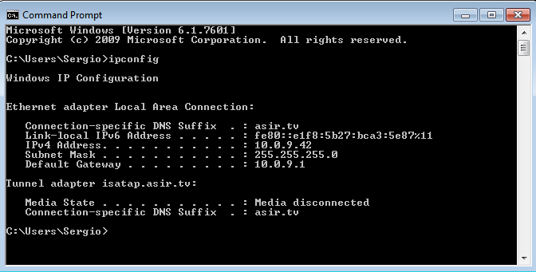

## Práctica 2.1 - DHCP docker

1. Configuración IP fija en la red:

Como en la configuración del docker-compose tengo asignada el tipo de red como "host", el contenedor cogerá de forma automática la IP del equipo principal, por lo que esta IP será la 10.0.9.1 en mi caso. Además, esto se puede comprobar teniendo en cuenta que la opción de enrutado es esta misma IP.

```
    option routers 10.0.9.1; 
```

Este es el docker-compose.yml

```
    version: "3.3"
services:
  asir_isc:
    container_name: asir_isc
    image: networkboot/dhcpd
    network_mode: "host"
    volumes:
      - ./data:/data
```

2. Configura interface de escucha. Reinicia y para el servicio para aplicar cambios.

Para añadir la interfaz en la que se va a escuchar el tráfico para el DHCP, solo hay que añadir el apartado "args: InterfaceName". Esto es para hacerlo directamente desde el docker-compose, aunque también se puede hacer asignando un group desde la configuración del servicio DHCP.

```
args: enp1s0
```

3. Añade un rango de IPs

El archivo de configuración "dhcpd.conf" es el que hay que abrir y modificar para poder definir un rango de IPs de forma manual que el servidor DHCP puede asignar. Es algo muy simple, y la forma de hacerlo sería la siguiente:

```
subnet 10.0.9.0 netmask 255.255.255.0 {    
    range 10.0.9.40 10.0.9.43;
```

De esta forma, solo las IPs de la 10.0.9.40 a la 10.0.9.43 podrán ser asignadas.

4. Configura IP fija para un cliente 

La configuración se hace gracias al apartado "group", en el que hay que definir tanto los "lease times" y luego se definen los parámetros de un host, entre los que deben de estar la dirección MAC junto a la IP que se quiere asignar

```
group {
   default-lease-time 500000;
    max-lease-time 10000000;

    host asir_client {
        hardware ethernet 08:00:27:6F:AD:EF; #Hay que poner la MAC del equipo que se quiere poner 
        fixed-address 10.0.9.42;
    } 
  }
```



(Imagen de confirmación de que funciona correctamente)